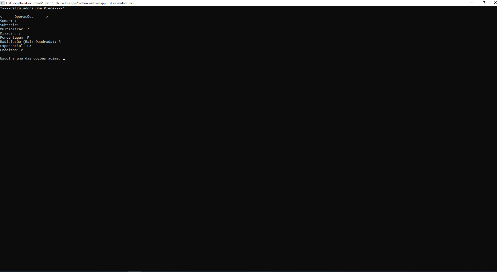

# Calculadora

Projeto:

Criar um software para que o usuário efetue operações matemáticas (o usuário digita os números, e o programa exibe o resultado):

Soma: +

Subtração: - 

Multiplicação: *

Divisão: /

Porcentagem: P

Radiciação: R

Exponencial: EX

Creditos: c

---

## _Screenshot_



## _Download_

Baixe o arquivo. Descompacte onde desejar.

[Download  do arquivo .zip](dist/Calculadora-.zip)

Ou caso você esteja usando Linux, execute o seguinte comando: 
```
dotnet Calculadora-.dll
```

Ou, se estiver no Windowns, pode dar  um duplo clique no icone do programa.

## Agradecimentos

- [Etec Adolpho Berezin](http://eteab.com.br/cms/)
- [Prof. Ermogenes](https://github.com/ermogenes) 
- [Prof. Diego Neri](https://github.com/diegoneri)
- [Dev C#](https://github.com/ermogenes/aulas-programacao-csharp)

---

Todos os Direitos reservados PIRATARIA È CRIME!!!


&copy; [Luan Paiva Tani](https://github.com/LuanTani) - Mongaguá 2020